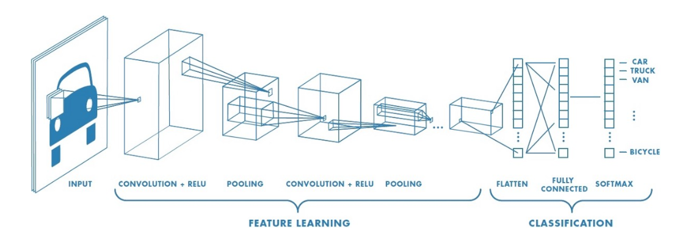
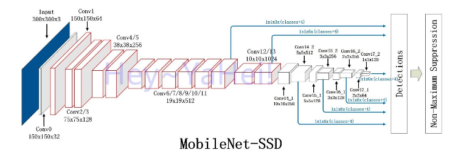

# Learning Tensorflow

## What am I trying to do

I am trying to create an object detector that I can run on a phone.
I want the detector to be able to recognize 2 types of things in an image and I want to know the location of the thing in the image.

## What got me interested in this

- [Object Detection in the browser](https://hackernoon.com/tensorflow-js-real-time-object-detection-in-10-lines-of-code-baf15dfb95b2)
- [Train controls to play Pacman ](https://storage.googleapis.com/tfjs-examples/webcam-transfer-learning/dist/index.html)
- [Simple Object Detection](https://github.com/tensorflow/tfjs-examples/tree/master/simple-object-detection)

## Performance of a model I trained

[Here](http://localhost:1234/) is a model I trained and you can evaluate its performance yourself.

## Main concept
Define networks that will be trained with data to perform 
- regression
- classification
- object detection
- clustering

##### Network



## Terminology

There are a number of terms which I have needed to learn.  The [tensorflow glossary](https://developers.google.com/machine-learning/glossary/) has been very useful.

In particular the following concepts I needed to get familiar with

I had to learn about the different connectivities between layers
- [Dense](https://developers.google.com/machine-learning/glossary/#dense_layer), [Convolutional](https://developers.google.com/machine-learning/glossary/#convolutional_layer) and [Pooling](https://developers.google.com/machine-learning/glossary/#pooling) 
    - Dense layers connect all outputs from a layer to the next but this can be expensive.
        - Presumption: Dense layers can detect association (things that go together or dont)
    - Convolution layer only connects inputs in a small 'areas' to the next layer.
        - Convolution filters can [detect/isolate/reify](http://aishack.in/tutorials/image-convolution-examples/) image features. 
    - Pooling was a new concept and is somewhat close to convolution.  The input to a subsequent layer can be a function of values in a small area.  The function might be the 'max' function.  
        - The significance of pooling is that it can facilitate scale and rotation invariance. 

- Sequential models - I had to learn what a 'sequential' model is. Its a model with layers where each layer connects only to the next layer. The alternative is a network with some layers that connect to layers beyond just the next layer.  

I had to learn about different types of learning and hence models
- [regression model](https://developers.google.com/machine-learning/glossary/#regression_model)
- [classification](https://developers.google.com/machine-learning/glossary/#classification_model) 
- object detection
- [clustering](https://developers.google.com/machine-learning/glossary/#clustering)


I had to learn about the convolution 
    - [Convolution as an operation is described here.](https://i.stack.imgur.com/J9E4z.png)  Convolution obviously is less 'expensive' that fully connected (dense) connectivity.
        -  This [page](http://setosa.io/ev/image-kernels/) has a nice presentation on what convolution acheives.
    -  The pretrained models utilized layers described as [depthwise separable convolution](https://towardsdatascience.com/a-basic-introduction-to-separable-convolutions-b99ec3102728).  The idea here is to reduce the number of computations required to perform a convolution operation.  

- With a connected network the output layers are a function of kernel, bias and activation function.
    - Kernels are the weights which are multiplied by the inputs. (Dot product)
    - The bias is added to the dot product result.
    - This value is then applied to the activation function.
        - There are [many activation functions](https://adventuresinmachinelearning.com/vanishing-gradient-problem-tensorflow/)
    - The output is then a single value in the layer.

- [Transfer learning](https://developers.google.com/machine-learning/glossary/#transfer_learning) - So this is how we can use a large deep learning model and extend it. This is what I am hoping to do.  There is a description below how this is realized.


## Getting Started

I have been reading everything I can find out tensorflow and trying to become familiar with the tensorflow ecosystem.

Particularly useful are
- [the api docs](https://js.tensorflow.org/api/latest)
    - [Tensors](https://www.tensorflow.org/js/guide/tensors_operations), [Models and Layers](https://www.tensorflow.org/js/guide/models_and_layers)
- [how to train models](https://www.tensorflow.org/js/guide/train_model)


## Know How

The tensorflow models are saved to 2 separate files.
- model.json - Has the architecture of the model 
- weights.bin - Binary file representing the kernel and bias


## Tools
The [tensorflow js visualization helper](https://js.tensorflow.org/api_vis/latest/) appears to be quite useful. [This](https://storage.googleapis.com/tfjs-vis/mnist/dist/index.html) demonstrates how it can be used.

api, 
transfer learning and object detection.


In the tensorflow js example there is a [simple-object-detection example](https://github.com/tensorflow/tfjs-examples/tree/master/simple-object-detection).


### Questions 


#### How to modify the base network to extend it?
First the pretrained model is loaded
```
const mobilenet = await tf.loadLayersModel('https://storage.googleapis.com/tfjs-models/tfjs/mobilenet_v1_0.25_224/model.json')
```
~

Next a new model is created which links the pretrained model inputs and outputs.  The layer training is disabled.
```
const layer = mobilenet.getLayer('conv_pw_11_relu');
const base = tf.model({inputs: mobilenet.inputs, outputs: layer.output});

for (const layer of base.layers) {
    layer.trainable = false;
}
```

Then an extension model is created 
```
let inputShape = truncatedBase.outputs[0].shape.slice(1) //14,14,128

const extension = tf.sequential();
extension.add(tf.layers.flatten({inputShape}));
extension.add(tf.layers.dense({units: 100, activation: 'relu'}));
extension.add(tf.layers.dense({units: 5}));
```

The base and extension are linked
```
const newOutput = extension.apply(truncatedBase.outputs[0]);
```

A new model is created which joins the inputs to the truncated base to the new outputs
```
const model = tf.model({inputs: truncatedBase.inputs, outputs: newOutput});
```

#### Why is fine grained learning required

The training occurs in 2 phases.

First we train the extension layers with all base layers frozen.
Then we unfreeze the last 3 layers and train again.

I imagine the idea is to use the base model features as they are to adjust the extension layer and it mostly right before allowing the rightmost mobilenet layers to update.